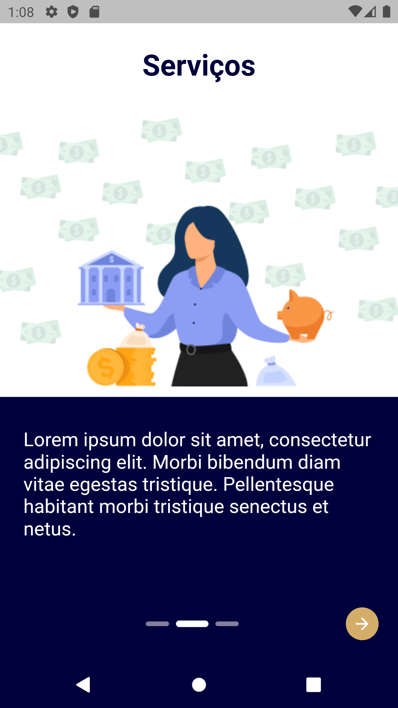

# Safra Partners

## Motivação

De acordo com uma pesquisa da PWC em 2019, no Brasil 95% das compras on-line utilizam marketplace.

Em termos de faturamento via e-commerce as plataformas de marketplace possuem uma representação de 78% do valor total faturado equivalente a R$ 81 bilhões de reais no ano de 2020.

---

O Safra Partners surge dessa oportunidade, através da disponibilização de seus dados através do Open Banking entregamos a você cliente um marketplace com serviços que você não encontra com facilidade no mercado.

Você como empresa parceira, acessa a plataforma e oferece seus produtos e serviços de forma online, contando com o Safra para virtualizar pagamentos e oferecer maior segurança a você e ao nossos clientes.

---

## Stacks

-   [Figma](https://www.figma.com/) - Design UX-UI.
-   [Ruby on Rails](https://rubyonrails.org/) - Framework da linguagem Ruby utilizado no desenvolvimento Back-end
-   [Flutter](https://vuejs.org/) - Framework da linguagem Dart utilizado no desenvolvimento Mobile
-   [MySQL](https://www.mysql.com/) - Sistema de gerenciamento de banco de dados, que utiliza a linguagem SQL como interface, usado no desenvolvimento.
-   [Postgress](https://www.postgresql.org/) - Sistema de gerenciamento de banco de dados, que utiliza a linguagem SQL como interface, usado na aplicação.

# Arquitetura da aplicação

    
 
# Front-end

O Front-end do aplicativo oferece uma experiência amigável ao usuário do Safra Partners em plataforma mobile.

## Interface

-   Login:

-   Introdução e solicitação de uso do Open Banking:

 
 

-   Home:

-   Timeline do contrato:

 
 
 
 
 

-   Informações do serviço/fornecedor:

---

## Uso (para teste):

1. Instalar o framework Flutter e o Android Studio (para uso do SDK);
2. Abrir o projeto pelo Android Studio (ou outro IDE compatível desejável);
3. Conectar ao computador um smatphone em modo depuração ou utilizar um emulador;
4. Executar o projeto no aparelho conectado.

## Fluxo:

1. Auth page
    - Autenticação do usuário;
    - Recuperação de senha;
2. Intro page
    - Introdução ao usuário sobre a plataforma;
    - Esclarecimento e confirmação dos dados a serem disponibilzados pelo usuário (Open Banking);
    - Página disponibilizada apenas na primeira utilização do aplicativo;
3. Home page
    - Visualização dos serviços contratados e serviços aguardando propostas;
    - Solicitação de novos serviços;
4. Contract page
    - Timeline com as etapas necessárias para a contratação do serviço:
    - Apresentação do serviço escolhido;
    - Informações necessárias para contratação;
    - Visualização de propostas;
    - Detalhamento da proposta e finalização da contratação;
5. Service page
    - Contato com o fornecedor após a contratação.
